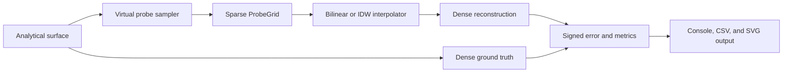
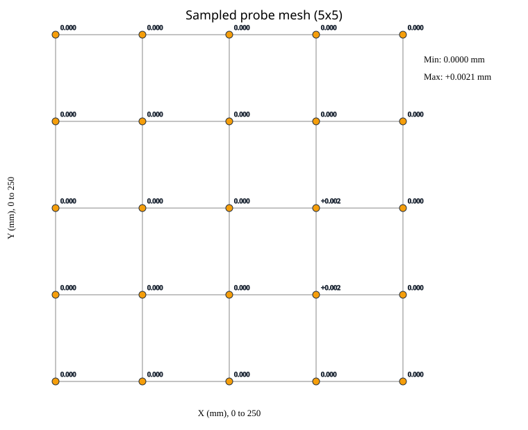
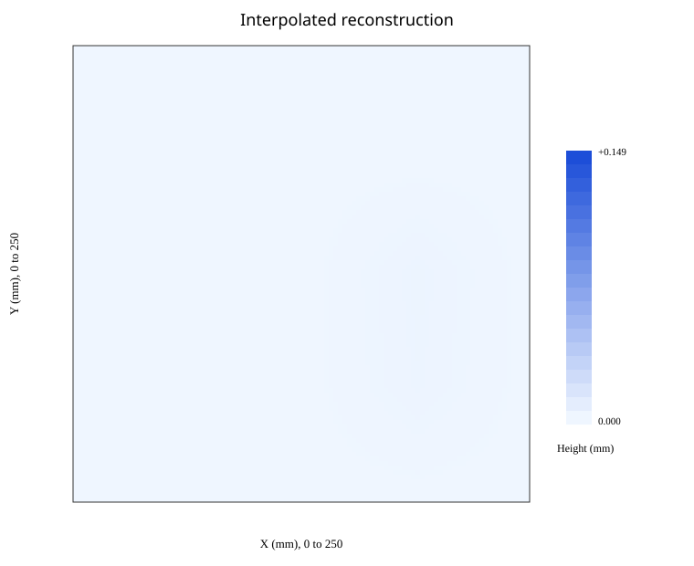
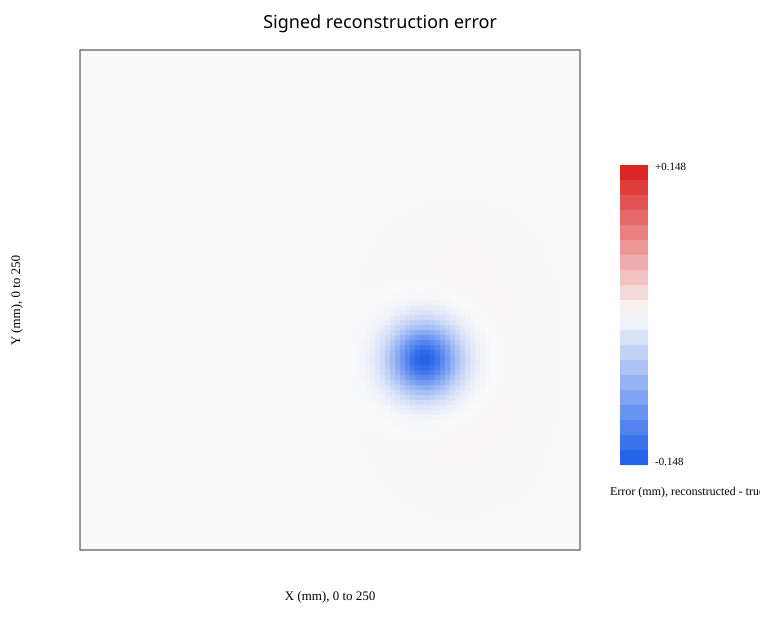
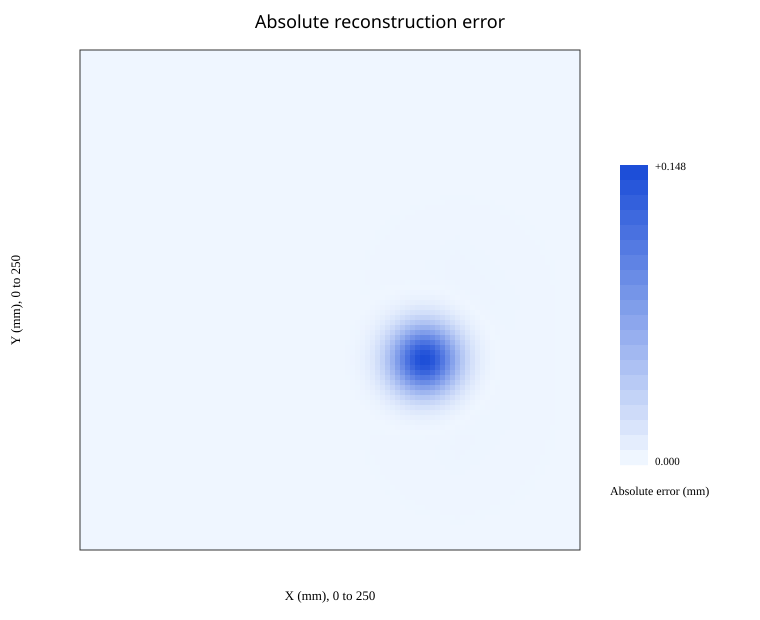
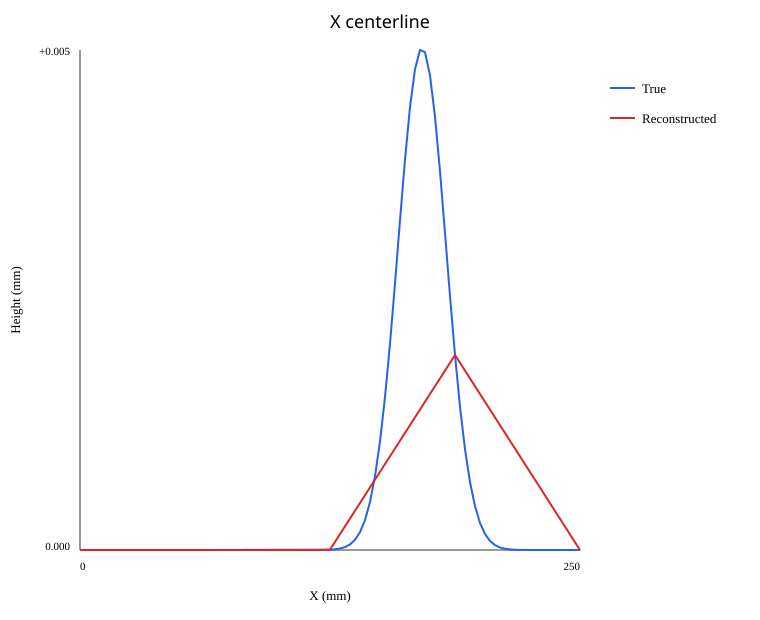
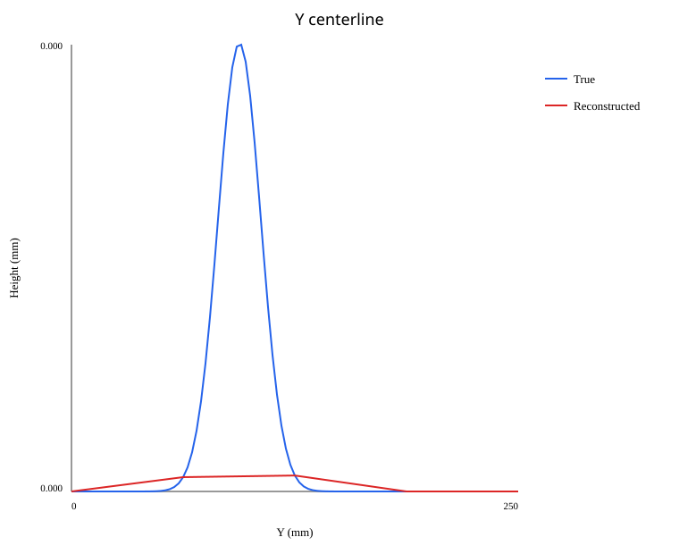
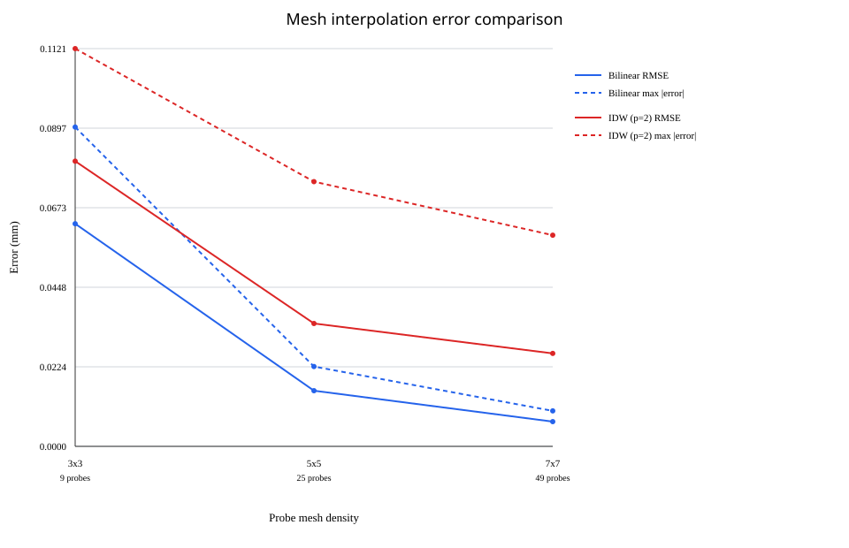

# Bed Mesh Interpolation Simulator

Numerical laboratory for sparse 3D-printer-bed probing.
It samples an analytical bed surface, reconstructs it from only the sparse probe
values, and measures interpolation error against an independent dense grid.

The project is a simulator, not printer firmware. It has no hardware, G-code,
Klipper, Marlin, web UI, database, GPU, Node.js, or Python dependency.

## Features

- immutable analytical surfaces: flat, tilt, bowl, saddle, Gaussian bump, and additive composites;
- deterministic built-in scenarios: `flat`, `tilt`, `bowl`, `saddle`, `hidden-bump`, and `complex`;
- uniform 3x3, 5x5, and 7x7 CLI probe grids with optional symmetric X/Y offsets;
- stateless bilinear and inverse-distance-weighted interpolation;
- independent dense evaluation, defaulting to 251x251 samples;
- RMSE, MAE, signed extrema, maximum absolute error, worst location, and P50/P90/P95/P99;
- seven self-contained deterministic SVG artifacts per simulation;
- CSV and SVG mesh-density comparison output;
- validation at public numerical and CLI boundaries;
- release CI, mathematical unit tests, artifact tests, and CLI smoke tests.

## Experiment



The interpolator receives only `ProbeGrid`; it never receives the analytical
surface. This boundary is the central correctness rule.

## Build and verify

```bash
dotnet restore BedMeshInterpolationSimulator.slnx
dotnet build BedMeshInterpolationSimulator.slnx --configuration Release --no-restore
dotnet test BedMeshInterpolationSimulator.slnx --configuration Release --no-build
dotnet format BedMeshInterpolationSimulator.slnx --verify-no-changes --no-restore
```

## Run a simulation

```bash
dotnet run --project src/BedMesh.Cli -- simulate --scenario hidden-bump --mesh 5 --interpolation bilinear --output output/hidden-bump-5x5
```

Each run writes:

- `true-surface.svg`
- `sampled-mesh.svg`
- `reconstructed-surface.svg`
- `signed-error.svg`
- `absolute-error.svg`
- `centerline-x.svg`
- `centerline-y.svg`

### Verified default output

```text
Bed Mesh Interpolation Simulator
  Scenario              hidden-bump
  Bed                   250 x 250 mm
  Probe grid            5 x 5 (25 samples)
  Probe spacing         62.5 x 62.5 mm
  Interpolation         Bilinear
  Evaluation            251 x 251 (63001 samples)
  RMSE                  0.012479 mm
  MAE                   0.002186 mm
  Maximum absolute      0.148552 mm
  Maximum positive      +0.001573 mm
  Maximum negative      -0.148552 mm
  Worst location        X=171 mm, Y=94 mm
  P50/P90/P95/P99       0.000000 / 0.000962 / 0.003427 / 0.073265 mm
```

The 0.15 mm bump is narrower than the 62.5 mm probe spacing and falls between
probe nodes. The reconstruction is therefore about 0.1486 mm too low at the
bump center. Interpolation cannot recreate information that was not sampled.

### Generated hidden-bump gallery

The checked-in gallery uses a 101x101 evaluation grid to keep the SVG previews
compact. It was generated with:

```bash
dotnet run --project src/BedMesh.Cli -- simulate --scenario hidden-bump --mesh 5 --interpolation bilinear --evaluation 101 --output docs/results/hidden-bump-5x5-bilinear
```

| Metric | Generated value |
|---|---:|
| RMSE | 0.012405 mm |
| MAE | 0.002160 mm |
| Maximum absolute error | 0.147543 mm |
| Worst location | X=170 mm, Y=95 mm |

| Sparse samples | Analytical truth |
|---|---|
|  |  |

| Bilinear reconstruction | Signed error |
|---|---|
|  |  |

| Absolute error | X centerline |
|---|---|
|  |  |



## Compare mesh densities

```bash
dotnet run --project src/BedMesh.Cli -- compare --scenario bowl --interpolation both --output output/compare-bowl
```

Comparison mode evaluates 3x3, 5x5, and 7x7 meshes for each selected algorithm.
It writes per-run SVG folders plus `comparison.csv` and `mesh-comparison.svg`.

### Generated comparison results

| Mesh | Probes | Algorithm | RMSE (mm) | MAE (mm) | Max abs. error (mm) |
|---|---:|---|---:|---:|---:|
| 3x3 | 9 | Bilinear | 0.062744 | 0.059757 | 0.089994 |
| 3x3 | 9 | IDW | 0.080381 | 0.074630 | 0.112104 |
| 5x5 | 25 | Bilinear | 0.015686 | 0.014939 | 0.022499 |
| 5x5 | 25 | IDW | 0.034629 | 0.028007 | 0.074609 |
| 7x7 | 49 | Bilinear | 0.006972 | 0.006640 | 0.009999 |
| 7x7 | 49 | IDW | 0.026199 | 0.020671 | 0.059516 |



[Download the generated comparison CSV](docs/results/bowl-comparison/comparison.csv).

For this smooth quadratic bowl, both algorithms improve with mesh density, while
bilinear interpolation has lower RMSE and maximum absolute error at every tested
mesh size.

## Commands

- `list-scenarios` lists the six built-in scenarios.
- `simulate` runs one mesh and one or both interpolation algorithms.
- `compare` runs all three supported CLI mesh densities.

Run `dotnet run --project src/BedMesh.Cli -- --help` for all options.

## Coordinate and error conventions

- `X` is in `[0, Width]` millimetres.
- `Y` is in `[0, Depth]` millimetres.
- `Z` is surface height/deformation in millimetres.
- signed error is `estimated - true`.
- positive error means the reconstruction is too high.
- negative error means the reconstruction is too low.

Built-in scenario surfaces reject coordinates outside their configured bed.
Interpolation rejects queries outside the probed bounds, so the current version
never extrapolates.

## Documentation

- [Architecture](docs/ARCHITECTURE.md)
- [Algorithms and numerical methods](docs/ALGORITHMS.md)
- [Surface models](docs/SURFACE_MODELS.md)
- [Built-in scenarios](docs/SCENARIOS.md)
- [SVG output](docs/SVG_OUTPUT.md)
- [Testing](docs/TESTING.md)

## Scope

The current version intentionally excludes printer connections, firmware mesh
parsing, G-code, adaptive meshing, gantry adjustment, Z fade, thermal modelling,
probe noise, printer kinematics, and compensation applied to motion commands.
