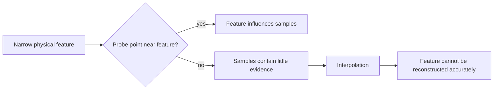

# Algorithms and Numerical Methods

# 1. Problem statement

Let the true bed surface be:

\[
z=f(x,y)
\]

Sparse probes provide:

\[
\mathcal P=
\{(x_i,y_i,z_i)\}_{i=1}^{N}
\]

where:

\[
z_i=f(x_i,y_i)
\]

An interpolation method constructs:

\[
\hat z=g(x,y;\mathcal P)
\]

The pointwise signed error is:

\[
e(x,y)=\hat z(x,y)-f(x,y)
\]

The simulator estimates the spatial reconstruction quality by evaluating \(e\) on a dense independent grid.

---

# 2. Uniform probe-grid generation

For bed width \(W\), depth \(D\), and `Nx × Ny` probes:

\[
x_i=i\frac{W}{N_x-1}
\]

\[
y_j=j\frac{D}{N_y-1}
\]

for:

\[
i=0,\ldots,N_x-1
\]

\[
j=0,\ldots,N_y-1
\]

Spacing:

\[
\Delta x=\frac{W}{N_x-1}
\]

\[
\Delta y=\frac{D}{N_y-1}
\]

Example for a 250 mm bed:

| Mesh | X/Y intervals | spacing |
|---|---:|---:|
| 3x3 | 2 | 125.0 mm |
| 5x5 | 4 | 62.5 mm |
| 7x7 | 6 | 41.6667 mm |

---

# 3. Bilinear interpolation

Consider a rectangular probe cell bounded by:

\[
x_1\le x\le x_2
\]

\[
y_1\le y\le y_2
\]

with node heights:

\[
z_{11}=z(x_1,y_1)
\]

\[
z_{21}=z(x_2,y_1)
\]

\[
z_{12}=z(x_1,y_2)
\]

\[
z_{22}=z(x_2,y_2)
\]

Normalize position:

\[
u=\frac{x-x_1}{x_2-x_1}
\]

\[
v=\frac{y-y_1}{y_2-y_1}
\]

Then:

\[
\hat z =
(1-u)(1-v)z_{11}
+u(1-v)z_{21}
+(1-u)vz_{12}
+uvz_{22}
\]

Equivalent two-stage form:

\[
z_{bottom}=(1-u)z_{11}+u z_{21}
\]

\[
z_{top}=(1-u)z_{12}+u z_{22}
\]

\[
\hat z=(1-v)z_{bottom}+v z_{top}
\]

## Properties

Bilinear interpolation reproduces any field of the form:

\[
f(x,y)=a+bx+cy+dxy
\]

exactly within a rectangular cell if node samples are exact.

Therefore a planar tilt:

\[
f(x,y)=a+bx+cy
\]

is an essential correctness test.

It is:

- local;
- piecewise bilinear;
- continuous across cell edges when neighboring cells share node values;
- generally not differentiable across cell boundaries;
- unable to infer high-frequency detail absent from node samples.

## Cell location

For a uniform grid:

\[
i=
\left\lfloor
\frac{x-x_{min}}{\Delta x}
\right\rfloor
\]

\[
j=
\left\lfloor
\frac{y-y_{min}}{\Delta y}
\right\rfloor
\]

Clamp:

\[
i\in[0,N_x-2]
\]

\[
j\in[0,N_y-2]
\]

Clamping is required for exact maximum-bound coordinates.

---

# 4. Inverse-distance weighting

For query point \(q=(x,y)\) and probe \(p_i=(x_i,y_i)\):

\[
d_i=
\sqrt{
(x-x_i)^2+(y-y_i)^2
}
\]

Weight:

\[
w_i=\frac{1}{d_i^p}
\]

with typical:

\[
p=2
\]

Estimate:

\[
\hat z(x,y)=
\frac{
\sum_{i=1}^{N}w_i z_i
}{
\sum_{i=1}^{N}w_i
}
\]

## Exact-node condition

If:

\[
d_k\le\epsilon
\]

return:

\[
\hat z=z_k
\]

immediately.

This avoids division by zero and preserves measured values.

## Interpretation of `p`

Low `p`:

- more global averaging;
- distant probes retain influence.

High `p`:

- more local behavior;
- nearest probes dominate.

IDW is not intrinsically more correct than bilinear interpolation. It is included for comparison.

---

# 5. Dense evaluation grid

The evaluation grid is independent of probe density.

For resolution \(R_x\times R_y\):

\[
x_i=i\frac{W}{R_x-1}
\]

\[
y_j=j\frac{D}{R_y-1}
\]

At each point:

\[
z_{true}=f(x_i,y_j)
\]

\[
z_{estimated}=g(x_i,y_j)
\]

\[
e_{ij}=z_{estimated}-z_{true}
\]

Recommended default:

\[
251\times251=63,001
\]

samples.

This is computationally trivial but spatially dense enough for clear visualization.

---

# 6. Root mean square error

Given errors \(e_1,\dots,e_N\):

\[
RMSE=
\sqrt{
\frac{1}{N}
\sum_{i=1}^{N}e_i^2
}
\]

RMSE penalizes larger errors more strongly than MAE.

---

# 7. Mean absolute error

\[
MAE=
\frac{1}{N}
\sum_{i=1}^{N}|e_i|
\]

MAE measures typical absolute reconstruction error.

---

# 8. Maximum absolute error

\[
E_{max}=
\max_i|e_i|
\]

Worst-error index:

\[
k=
\operatorname*{argmax}_i |e_i|
\]

Worst location:

\[
(x_w,y_w)=(x_k,y_k)
\]

This metric is particularly relevant to first-layer printing because a localized error can matter even if average error is low.

---

# 9. Signed extremes

Maximum positive:

\[
E_+=\max_i e_i
\]

Maximum negative:

\[
E_-=\min_i e_i
\]

Interpretation under:

\[
e=\hat z-z
\]

- positive: reconstructed bed is too high;
- negative: reconstructed bed is too low.

---

# 10. Absolute-error percentiles

Construct:

\[
a_i=|e_i|
\]

Sort:

\[
a_{(1)}\le a_{(2)}\le\dots\le a_{(N)}
\]

Nearest-rank percentile at fraction \(p\):

\[
r=\lceil pN\rceil
\]

\[
P_p=a_{(r)}
\]

with one-based rank.

Use:

- P50,
- P90,
- P95,
- P99.

---

# 11. Spatial sampling and aliasing

Probe spacing imposes a spatial sampling limitation.

A deformation significantly narrower than the probe spacing may be weakly sampled or missed.



Interpolation does not create missing information.

This is the key numerical insight of the repository.

---

# 12. Why more probe points do not solve every deformation

Increasing mesh size:

\[
3\times3 \rightarrow 5\times5 \rightarrow 7\times7
\]

reduces nominal spacing:

\[
\Delta \propto \frac{1}{N-1}
\]

but reconstruction accuracy still depends on:

- deformation spatial width;
- deformation location relative to probe nodes;
- interpolation model;
- anisotropy;
- measurement noise;
- boundaries.

A narrow Gaussian centered exactly on a probe can be reconstructed far better than the same Gaussian translated halfway between probes.

---

# 13. Probe alignment experiment

Let mesh spacing be \(\Delta x,\Delta y\).

Compare a bump center at:

\[
(x_c,y_c)=(x_i,y_j)
\]

against:

\[
(x_c,y_c)=
\left(
x_i+\frac{\Delta x}{2},
y_j+\frac{\Delta y}{2}
\right)
\]

The surface is identical except translation.

The second case can exhibit substantially larger maximum error.

---

# 14. Numerical precision

Use `double`.

Do not round:

- probe coordinates;
- surface heights;
- interpolation factors;
- evaluation values;
- metrics.

Round only formatted output.

Recommended test tolerances:

```text
exact/simple arithmetic fixtures: 1e-12
surface/interpolation identity:    1e-10
SVG formatting tests:              structural, not floating exactness
```

---

# 15. Complexity

Let:

- `P` = number of probes;
- `E` = number of dense evaluation points.

Bilinear:

- cell lookup on uniform grid: \(O(1)\);
- interpolation: \(O(1)\);
- total: \(O(E)\).

IDW using all probes:

- interpolation: \(O(P)\);
- total: \(O(EP)\).

For 7x7 probes:

\[
P=49
\]

and 251x251 evaluation:

\[
E=63,001
\]

so IDW still requires only about 3.1 million probe contributions, trivial for .NET on a modern CPU.
