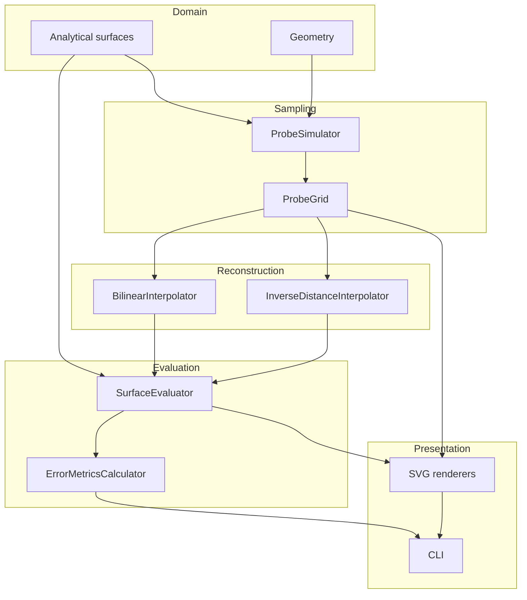
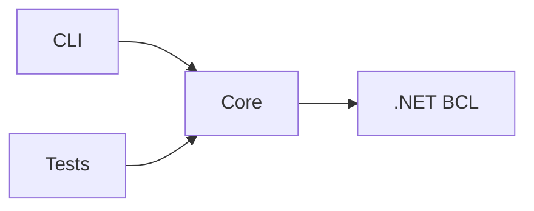
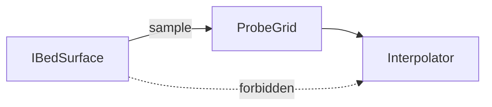
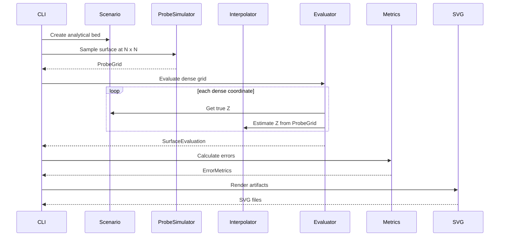
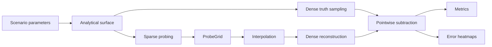
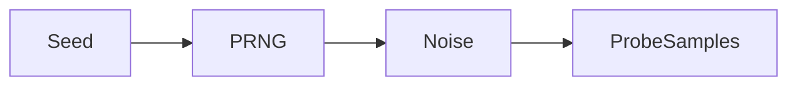

# Architecture

## System purpose

The program models a printer bed as a continuous analytical scalar field:

\[
z=f(x,y)
\]

A virtual probe samples this field at a small number of coordinates. An interpolation algorithm sees **only those samples** and estimates the surface between them.

A separate dense evaluator compares the estimate against the original analytical field.

## Component architecture



## Dependency rule



`BedMesh.Core` must not reference CLI concerns.

## Information boundary

The most important architectural invariant is:



The interpolator must never receive the analytical surface.

Otherwise the simulator would accidentally leak ground truth into reconstruction.

## Main runtime sequence



## Core abstractions

### `IBedSurface`

Represents ground truth.

```csharp
public interface IBedSurface
{
    double GetHeight(double x, double y);
}
```

### `ProbeGrid`

Represents exactly what the printer has measured.

It contains:

- physical X/Y coordinate;
- measured Z;
- logical row/column index.

### `ISurfaceInterpolator`

Consumes only `ProbeGrid`.

```csharp
public interface ISurfaceInterpolator
{
    string Name { get; }
    double Interpolate(ProbeGrid grid, double x, double y);
}
```

### `SurfaceEvaluator`

Creates dense truth/reconstruction/error samples.

## Data flow



## Error convention

\[
e=\hat z-z
\]

This convention is mandatory across:

- evaluator;
- metrics;
- console;
- CSV;
- SVG legends;
- documentation.

## Determinism

The MVP has no random data.

If probe noise is added later:



A seed must be mandatory or defaulted deterministically.

## Extension points

Safe future extensions:

- probe noise;
- alternative interpolation;
- adaptive mesh experiments;
- imported measured bed data;
- thermal deformation models;
- real probe datasets;
- bicubic interpolation.

Do not couple these extensions to printer firmware.
