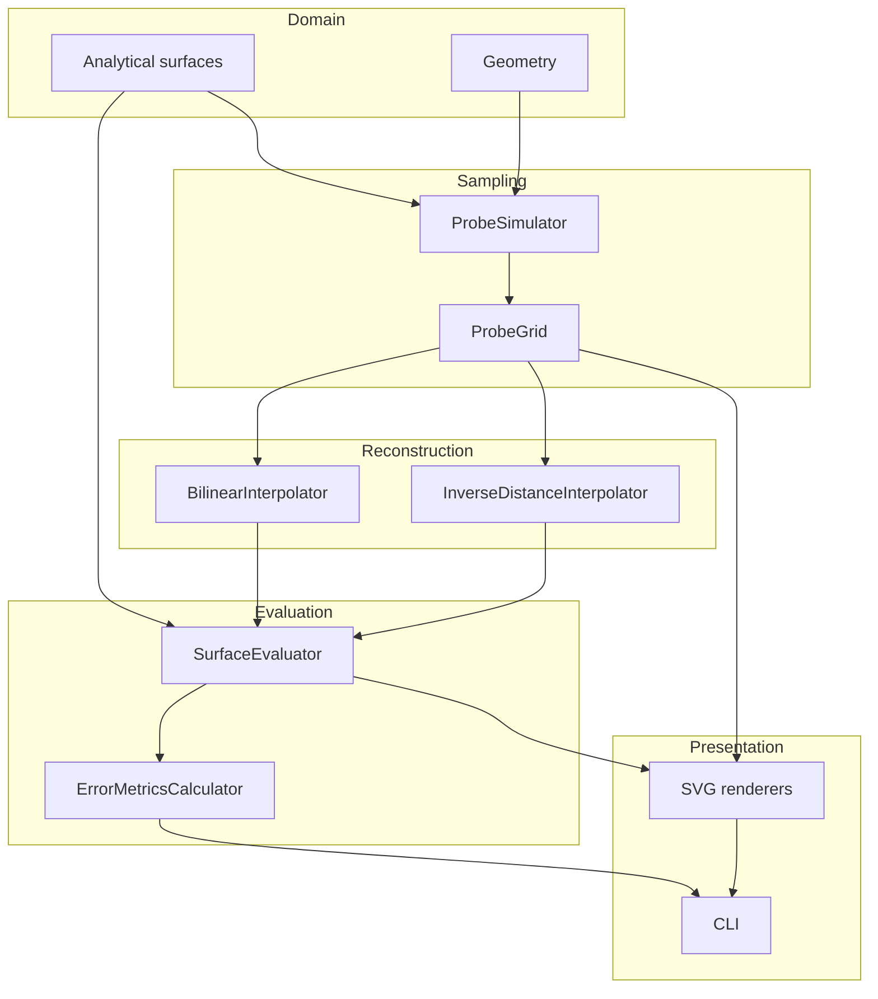
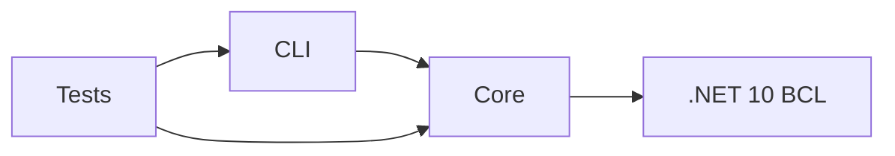
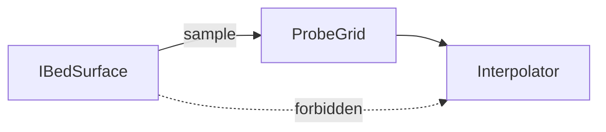
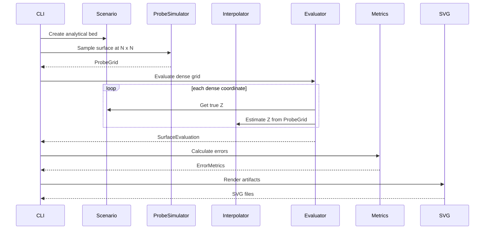
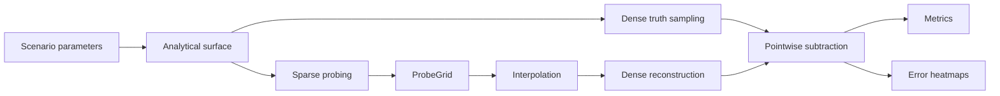
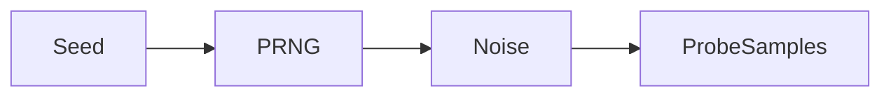

# Architecture

This document preserves the conceptual architecture and maps it to the current
.NET 10 implementation. All listed runtime components are implemented.

## System purpose

The program models a printer bed as a continuous analytical scalar field:

\[
z=f(x,y)
\]

A virtual probe samples this field at a small number of coordinates. An interpolation algorithm sees **only those samples** and estimates the surface between them.

A separate dense evaluator compares the estimate against the original analytical field.

## Component architecture



## Dependency rule



`BedMesh.Core` must not reference CLI concerns.

The test project also references `BedMesh.Cli` so CLI smoke tests can execute
public commands in process. Production dependency direction remains CLI to Core;
`BedMesh.Core` has no CLI or test dependency.

## Information boundary

The most important architectural invariant is:



The interpolator must never receive the analytical surface.

Otherwise the simulator would accidentally leak ground truth into reconstruction.

## Main runtime sequence



`ScenarioCatalog` creates the selected analytical model and wraps it with
`BoundedSurface`. `SimulationRunner` coordinates sampling, evaluation, metrics,
and the seven per-run SVG artifacts. In comparison mode, the CLI repeats this
sequence for each mesh and algorithm, then writes aggregate CSV and SVG output.

## Core abstractions

### `IBedSurface`

Represents ground truth.

```csharp
public interface IBedSurface
{
    double GetHeight(double x, double y);
}
```

### `ProbeGrid`

Represents exactly what the printer has measured.

It contains:

- physical X/Y coordinate;
- measured Z;
- logical row/column index.

### `ISurfaceInterpolator`

Consumes only `ProbeGrid`.

```csharp
public interface ISurfaceInterpolator
{
    string Name { get; }
    double Interpolate(ProbeGrid grid, double x, double y);
}
```

### `SurfaceEvaluator`

Creates dense truth/reconstruction/error samples.

### `BoundedSurface`

Wraps built-in scenario ground truth and rejects non-finite or out-of-bed
coordinates before delegating to the analytical model.

### `SimulationRunner`

Consumes a `SimulationRequest` and returns the sampled mesh, dense evaluation,
metrics, and deterministic artifact paths as one `SimulationResult`.

### SVG renderers

`SvgRenderer` writes the seven per-simulation documents.
`MeshComparisonSvgRenderer` writes aggregate RMSE and maximum-absolute-error
series for comparison mode.

## Implemented component map

| Area | Main types | Source |
|---|---|---|
| Geometry | `Point2D`, `SurfacePoint`, `Bounds2D`, `BedGeometry`, `Numeric` | `Geometry.cs` |
| Ground truth | `IBedSurface` and analytical models | `Surfaces.cs` |
| Boundary guard | `BoundedSurface` | `BoundedSurface.cs` |
| Sampling | `ProbeSimulator`, `ProbeGrid`, `ProbeSample` | `Sampling.cs` |
| Reconstruction | bilinear and IDW interpolators | `Interpolation.cs` |
| Evaluation and metrics | evaluator, evaluation records, metrics calculator | `Evaluation.cs` |
| Scenarios | `ScenarioCatalog`, `SimulationScenario` | `Scenarios.cs` |
| Orchestration | request/result records and `SimulationRunner` | `SimulationRunner.cs` |
| SVG | per-run and comparison renderers | `SvgRenderer.cs`, `MeshComparisonSvgRenderer.cs` |
| Commands | `CliApp` | `BedMesh.Cli/CliApp.cs` |

## Data flow



## Error convention

\[
e=\hat z-z
\]

This convention is mandatory across:

- evaluator;
- metrics;
- console;
- CSV;
- SVG legends;
- documentation.

## Validation boundaries

- geometry and public numerical configuration reject non-finite values;
- bed dimensions, Gaussian widths, and IDW power must be positive;
- built-in scenario queries must remain inside the configured bed;
- probe offsets must leave a non-empty sampled rectangle;
- interpolation queries must remain inside probed bounds;
- CLI meshes are restricted to 3, 5, or 7;
- CLI evaluation dimensions are restricted to 2 through 2001.

These rules keep invalid coordinates at public boundaries and prevent
extrapolation in the current version.

## Output ownership

`SimulationRunner` owns numerical execution and delegates per-run drawing to
`SvgRenderer`. The CLI owns directory layout and console reporting. `compare`
creates one directory per mesh/algorithm and writes `comparison.csv` plus
`mesh-comparison.svg` at the comparison root.

## Determinism

The current implementation has no random data.

If probe noise is added later:



A seed must be mandatory or defaulted deterministically.

The implemented runtime also omits timestamps. Scenario parameters, iteration
order, invariant numeric formatting, CSV rows, and SVG element order are stable.
Repeating the same request produces byte-identical SVG documents.

## Extension points

Safe future extensions:

- probe noise;
- alternative interpolation;
- adaptive mesh experiments;
- imported measured bed data;
- thermal deformation models;
- real probe datasets;
- bicubic interpolation.

Do not couple these extensions to printer firmware.

## Current scope boundaries

The implementation intentionally contains no printer hardware, firmware parser,
G-code, web UI, database, dependency-injection framework, plotting service,
network dependency, or GPU layer. The documented extension points must preserve
the ground-truth boundary and remain independent of printer firmware.
