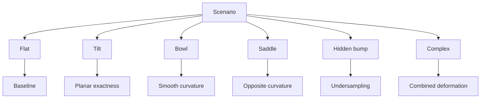
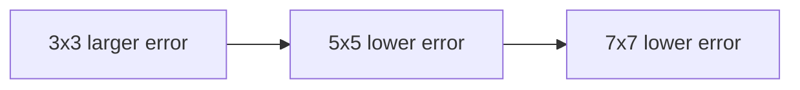
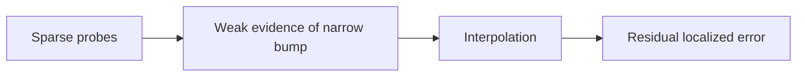

# Built-in Scenarios

Built-in scenarios must be deterministic and documented.

Default bed:

\[
W=D=250\text{ mm}
\]

---

# 1. `flat`

Purpose:

- numerical baseline;
- zero-error validation;
- constant-range SVG edge case.

Surface:

\[
z=0
\]

Expected:

- bilinear RMSE ≈ 0;
- IDW RMSE ≈ 0.

---

# 2. `tilt`

Purpose:

- prove bilinear exactness for a plane.

Recommended:

\[
\Delta z_x=+0.12\text{ mm}
\]

\[
\Delta z_y=-0.08\text{ mm}
\]

Centered:

\[
z=
\frac{0.12}{250}(x-125)
-
\frac{0.08}{250}(y-125)
\]

Expected:

- bilinear reconstruction ≈ exact for 3x3, 5x5, 7x7.

---

# 3. `bowl`

Purpose:

- smooth curvature;
- demonstrate convergence with mesh density.

Recommended:

\[
z=
0.18
\left[
\left(\frac{x-125}{125}\right)^2+
\left(\frac{y-125}{125}\right)^2
\right]
\]

Expected:

\[
error_{7x7}<error_{5x5}<error_{3x3}
\]

for major aggregate metrics.

Do not encode strict values in acceptance tests.

---

# 4. `saddle`

Purpose:

- opposite curvature along X and Y;
- test sign changes.

Recommended:

\[
z=
0.15
\left[
\left(\frac{x-125}{125}\right)^2-
\left(\frac{y-125}{125}\right)^2
\right]
\]

---

# 5. `hidden-bump`

Purpose:

- flagship undersampling demonstration.

Recommended Gaussian:

\[
A=0.15\text{ mm}
\]

\[
x_c=171\text{ mm}
\]

\[
y_c=94\text{ mm}
\]

\[
\sigma_x=\sigma_y=12\text{ mm}
\]

Thus:

\[
z=
0.15
\exp
\left[
-
\left(
\frac{(x-171)^2}{288}+
\frac{(y-94)^2}{288}
\right)
\right]
\]

Since:

\[
2\sigma^2=288
\]

The feature FWHM is:

\[
\approx28.26\text{ mm}
\]

which is substantially narrower than 5x5 spacing:

\[
62.5\text{ mm}
\]

Expected lesson:

- even a 7x7 mesh may retain visible localized error;
- bump alignment relative to nodes materially affects maximum error.

---

# 6. `complex`

Purpose:

- visually plausible synthetic warped bed.

Recommended combination:

```text
small X/Y tilt
+
broad bowl
+
positive local bump
+
negative local depression
```

Example:

Tilt:

\[
z_t=
\frac{0.08}{250}(x-125)
-
\frac{0.05}{250}(y-125)
\]

Bowl:

\[
z_b=
0.10
\left[
\left(\frac{x-125}{125}\right)^2+
\left(\frac{y-125}{125}\right)^2
\right]
\]

Bump:

\[
z_1=
0.09
\exp
\left[
-\left(
\frac{(x-176)^2}{2(16)^2}
+
\frac{(y-82)^2}{2(18)^2}
\right)
\right]
\]

Depression:

\[
z_2=
-0.07
\exp
\left[
-\left(
\frac{(x-72)^2}{2(20)^2}
+
\frac{(y-182)^2}{2(14)^2}
\right)
\right]
\]

Total:

\[
z=z_t+z_b+z_1+z_2
\]

---

# Scenario comparison matrix



## Recommended README demonstrations

### Demonstration A — smooth convergence

Run bowl:

```text
3x3
5x5
7x7
```

Expected conceptual result:



### Demonstration B — hidden feature

Run hidden-bump:



### Demonstration C — same bump, different alignment

Translate bump from probe node to cell center.

This shows that sample placement matters independently from probe count.
