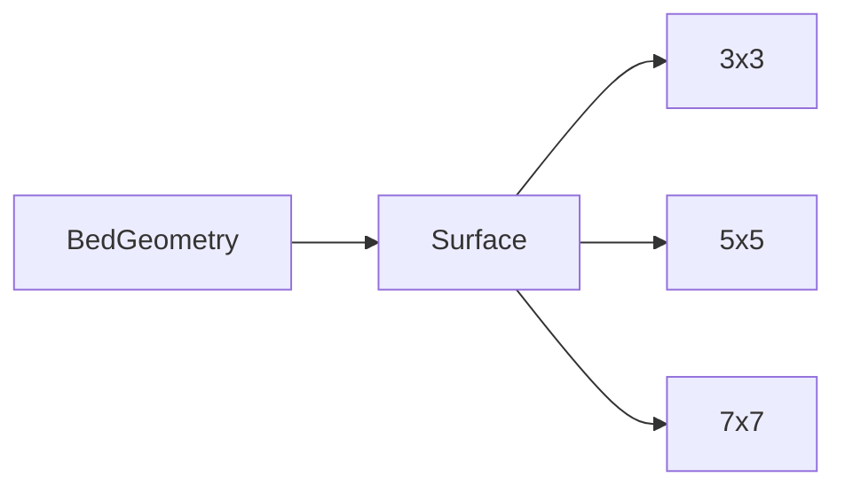
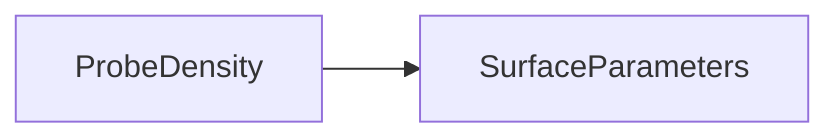

# Analytical Surface Models

All surfaces implement:

```csharp
public interface IBedSurface
{
    double GetHeight(double x, double y);
}
```

All distances and heights are in millimetres.

The current implementation includes every model through composite surfaces, plus
a `BoundedSurface` wrapper for physical bed limits. Distances and heights are
millimetres; radii and Gaussian sigma values are validated as positive finite
numbers.

---

# 1. Flat surface

\[
z(x,y)=c
\]

Default:

\[
c=0
\]

Use:

- baseline;
- interpolation exactness;
- SVG constant-range handling.

---

# 2. Tilt / plane

Centered form:

\[
z(x,y)=
z_0+
a(x-x_c)+
b(y-y_c)
\]

where:

- \(a\) is X slope in mm/mm;
- \(b\) is Y slope in mm/mm.

Alternative user-facing configuration can specify total rise across bed:

\[
a=\frac{\Delta z_x}{W}
\]

\[
b=\frac{\Delta z_y}{D}
\]

Example:

```text
Width          250 mm
X total rise   0.12 mm
a              0.00048 mm/mm
```

Bilinear interpolation should reproduce this exactly to floating-point tolerance.

---

# 3. Bowl

Use an elliptical paraboloid:

\[
z(x,y)=
A\left[
\left(\frac{x-x_c}{r_x}\right)^2+
\left(\frac{y-y_c}{r_y}\right)^2
\right]
\]

If `A > 0`, height increases away from center.

For a normalized bowl where the edge scale is easier to control, define:

\[
r_x=\frac{W}{2}
\]

\[
r_y=\frac{D}{2}
\]

and optionally subtract a reference offset.

A centered form with center at zero naturally gives:

\[
z(x_c,y_c)=0
\]

---

# 4. Saddle

Hyperbolic paraboloid:

\[
z(x,y)=
A\left[
\left(\frac{x-x_c}{r_x}\right)^2-
\left(\frac{y-y_c}{r_y}\right)^2
\right]
\]

Characteristics:

- positive curvature along one axis;
- negative curvature along the other;
- center at zero if no offset.

Useful for testing anisotropic deformation.

---

# 5. Gaussian bump

\[
z(x,y)=
A
\exp
\left[
-
\left(
\frac{(x-x_c)^2}{2\sigma_x^2}+
\frac{(y-y_c)^2}{2\sigma_y^2}
\right)
\right]
\]

Parameters:

- \(A\): amplitude;
- \(x_c,y_c\): center;
- \(\sigma_x,\sigma_y\): spatial widths.

At center:

\[
z(x_c,y_c)=A
\]

At one standard deviation along X:

\[
z(x_c+\sigma_x,y_c)=Ae^{-1/2}
\approx0.60653A
\]

Gaussian full width at half maximum:

\[
FWHM=2\sqrt{2\ln2}\sigma
\approx2.35482\sigma
\]

This lets the documentation compare feature width directly with probe spacing.

Example:

```text
A       0.15 mm
sigma   12 mm
FWHM    ~28.26 mm
```

On a 250 mm bed:

```text
5x5 spacing = 62.5 mm
```

so the feature is much narrower than sample spacing.

---

# 6. Gaussian depression

No separate class is required.

Use negative amplitude:

\[
A<0
\]

Example:

\[
A=-0.08\text{ mm}
\]

---

# 7. Composite surface

Additive composition:

\[
z_{total}(x,y)=
\sum_{k=1}^{M}z_k(x,y)
\]

Implementation:

```csharp
public sealed class CompositeSurface : IBedSurface
{
    private readonly IReadOnlyList<IBedSurface> _surfaces;

    public double GetHeight(double x, double y)
    {
        double total = 0;

        foreach (var surface in _surfaces)
        {
            total += surface.GetHeight(x, y);
        }

        return total;
    }
}
```

This allows scenarios like:

\[
z=
z_{tilt}
+
z_{bowl}
+
z_{bump}
-
z_{depression}
\]

---

# 8. Recommended normalization

Surface definitions should not secretly depend on probe density.

A surface belongs to physical bed coordinates.

Correct:



Incorrect:



The exact same physical surface must be sampled by all compared meshes.

---

# 9. Boundary behavior

Analytical surfaces are defined across the complete bed bounds.

The simulator does not clamp surface heights.

Coordinates outside the bed are invalid in the current simulator.
`ScenarioCatalog` wraps every built-in model in `BoundedSurface`, which accepts
inclusive coordinates from `(0, 0)` through `(Width, Depth)` and rejects
non-finite or out-of-bed queries. Individual analytical types remain reusable;
the wrapper supplies the physical boundary.

---

# 10. Optional future models

Possible later additions:

- sinusoidal ripple:

\[
z=A\sin(k_xx+\phi_x)\sin(k_yy+\phi_y)
\]

- cylindrical bow;
- radial ring deformation;
- piecewise local dent;
- Fourier-generated synthetic bed;
- imported measured bed samples.

A sinusoidal surface would be especially useful for formal spatial-frequency
experiments, but is not implemented in the current version.

## Current implementation map

| Model | Source type |
|---|---|
| Flat | `FlatSurface` |
| Plane | `TiltSurface` |
| Elliptical paraboloid | `BowlSurface` |
| Hyperbolic paraboloid | `SaddleSurface` |
| Local bump or depression | `GaussianBumpSurface` |
| Additive combination | `CompositeSurface` |
| Physical bed boundary | `BoundedSurface` |

All model types live in `src/BedMesh.Core`. `ScenarioCatalog.Create` scales
built-in models for custom bed dimensions: tilt preserves total rise, bowl and
saddle radii use half-spans, and Gaussian centres and widths scale from the
documented 250 mm baseline.

Constructors reject non-finite parameters. Radii and Gaussian sigma values must
be positive, while Gaussian amplitude may be negative to model a depression.
