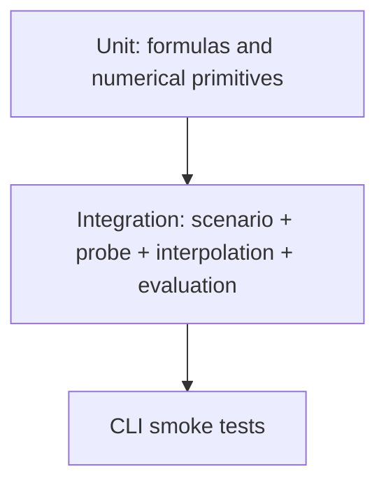

# Testing Strategy

The tests must verify mathematics, not only code paths.

# 1. Geometry tests

Validate:

- positive dimensions;
- finite values;
- bounds behavior;
- coordinate generation.

# 2. Surface-model tests

## Flat

For arbitrary valid `(x,y)`:

\[
z=c
\]

## Tilt

Use a hand-calculated point.

Example:

\[
z=0.001x-0.002y
\]

at:

\[
(x,y)=(10,20)
\]

must produce:

\[
0.01-0.04=-0.03
\]

## Bowl

At center:

\[
z=0
\]

for centered zero-offset form.

## Saddle

At center:

\[
z=0
\]

and signs must differ along principal axes.

## Gaussian

At center:

\[
z=A
\]

At one sigma:

\[
z=Ae^{-1/2}
\]

## Composite

Output equals exact sum.

---

# 3. Probe-grid tests

For 250 mm 5x5:

Expected coordinates:

```text
0
62.5
125
187.5
250
```

Probe count:

\[
5\times5=25
\]

Every stored Z must equal the analytical surface evaluated at that coordinate.

---

# 4. Bilinear interpolation tests

## Exact node reproduction

For every sample:

\[
I(x_i,y_j)=z_{ij}
\]

## Constant field

All interpolated values equal constant.

## Plane exactness

For:

\[
f(x,y)=a+bx+cy
\]

test many interior coordinates.

Expected:

```text
abs(actual - expected) <= 1e-10
```

## Hand fixture

Given:

```text
z11 = 0
z21 = 2
z12 = 4
z22 = 6
```

at cell midpoint:

\[
u=v=0.5
\]

Expected:

\[
\hat z=
0.25(0+2+4+6)=3
\]

## Boundary

Test:

- minimum X;
- maximum X;
- minimum Y;
- maximum Y;
- corners.

## Internal edge continuity

Choose coordinate on shared edge.

Evaluate from infinitesimally left/right or expose a cell helper for deterministic comparison.

Reconstruction must be continuous within tolerance.

---

# 5. IDW tests

## Exact node

Must return exact Z.

## Symmetric pair

Probes:

```text
(0,0) -> 0
(2,0) -> 2
```

At:

```text
(1,0)
```

with equal distances, expected:

\[
z=1
\]

## Invalid power

Reject:

```text
0
negative
NaN
Infinity
```

---

# 6. Evaluation tests

Use a known true surface and a fake interpolator.

Example fake:

\[
\hat z=z+0.1
\]

Then every evaluation point must have:

\[
e=0.1
\]

This verifies the sign convention.

---

# 7. Metrics tests

Fixture:

```text
errors = [-2, -1, 1, 2]
```

MAE:

\[
\frac{2+1+1+2}{4}=1.5
\]

RMSE:

\[
\sqrt{
\frac{4+1+1+4}{4}
}
=
\sqrt{2.5}
\]

Maximum absolute:

\[
2
\]

Maximum positive:

\[
2
\]

Maximum negative:

\[
-2
\]

Use another fixture with unique maximum for deterministic worst coordinate.

---

# 8. Percentile tests

Using nearest rank and sorted:

```text
[1, 2, 3, 4, 5]
```

Verify P50/P90 etc against explicitly calculated ranks.

---

# 9. Scenario tests

Each built-in scenario:

- creates successfully;
- evaluates finite values;
- supports 3x3, 5x5, 7x7;
- produces finite metrics.

For `tilt`, bilinear RMSE must be near zero.

For `flat`, both methods must be near zero.

Avoid asserting that every metric must monotonically decrease for every arbitrary localized scenario, because sampling alignment can violate that simplistic expectation.

That caveat is educationally important.

---

# 10. SVG tests

Validate XML:

```csharp
var document = XDocument.Parse(svg);
```

Reject output containing:

```text
NaN
Infinity
-Infinity
```

Test:

- `<svg>` root;
- title;
- axis labels;
- units;
- error sign convention;
- deterministic output for same input.

---

# 11. CLI smoke tests

Commands:

```text
simulate --scenario flat --mesh 3
simulate --scenario hidden-bump --mesh 5
simulate --scenario complex --mesh 7 --interpolation both
compare --scenario bowl
```

Verify exit code 0 and artifacts exist.

---

# 12. Numerical tolerance guidance

Prefer:

```text
1e-12  simple exact fixtures
1e-10  interpolation identity
1e-9   only where accumulated arithmetic warrants it
```

Never hide poor numerical behavior behind loose tolerances.

---

# 13. Test pyramid



Most tests should be unit tests.

---

# 14. Regression fixtures

Once the implementation is stable, optionally preserve a small deterministic CSV fixture for one scenario.

Do not snapshot huge SVG documents unless there is a clear reason; structural SVG tests are less brittle.
